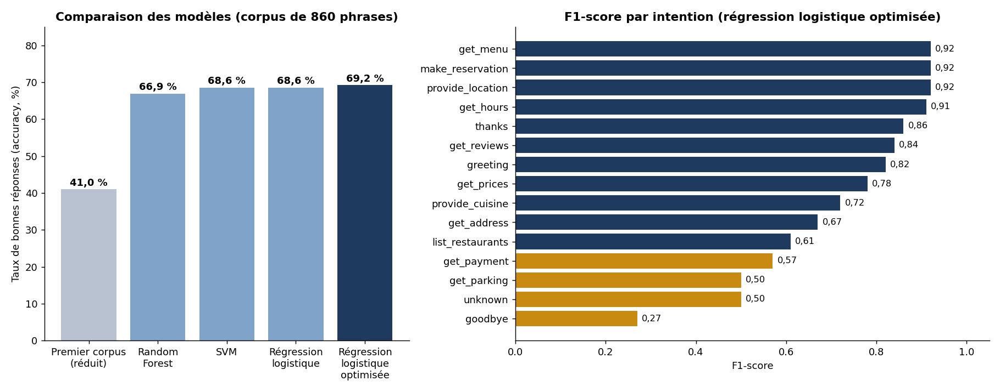

# 🍽️ Assistant restaurant : chatbot NLP de recommandation

> Projet de Master Data & IA, Nexa Digital School, réalisé en binôme (décembre 2025).
> Un chatbot qui aide l'utilisateur à trouver un restaurant selon la ville, le type de cuisine et les notes des clients.



## En bref

| | |
|---|---|
| 📦 Données | 5 fichiers open data fusionnés : **130 restaurants, 1 161 avis, 17 villes, 23 cuisines** |
| 💬 Corpus | **860 phrases** d'entraînement, réparties en **15 intentions** |
| 🧠 Modèle | Régression logistique optimisée : **69 %** de bonnes réponses, contre **41 %** avec notre premier corpus |
| 🖥️ Interface | Application web **Streamlit** |

## Exemple de conversation

```
👤 Bonjour
🤖 Bonjour ! 🍽️ Je suis votre assistant restaurant. Dans quelle ville cherchez-vous ?
   [intention : greeting · confiance 0,98]

👤 Je suis à San Luis Potosi
🤖 Parfait ! San Luis Potosi. Quel type de cuisine ?
   [intention : provide_location · confiance 0,79]

👤 Je veux du mexicain
🤖 Voici les restaurants Mexican à San Luis Potosi (9 trouvés) : …
   [intention : provide_cuisine · confiance 0,84]
```

Le chatbot **retient le contexte** : il garde en mémoire la ville et la cuisine choisies au fil de la conversation.

## Comment ça marche

### 1. Préparation des données
Fusion de 5 fichiers (restaurants, cuisines, paiements, parkings, notes) en une base unique de 130 restaurants.

### 2. Corpus d'intentions
Création de 860 phrases d'exemple réparties en 15 intentions : salutation, ville, cuisine, liste des restaurants, menu, adresse, horaires, prix, réservation, avis, paiement, parking, remerciement, au revoir et question inconnue.

### 3. Pipeline NLP
- **Nettoyage avec NLTK** : passage en minuscules, tokenisation, suppression des mots vides, lemmatisation.
- **Vectorisation TF-IDF** : 1 000 caractéristiques, mots seuls et paires de mots.
- **Classification** : comparaison de 3 modèles (régression logistique, Random Forest, SVM), découpage 80/20 et validation croisée.
- **Optimisation** avec GridSearchCV : régression logistique avec `C = 10`.

### 4. Gestion du dialogue
- **Seuil de confiance** : en dessous, le chatbot demande de reformuler plutôt que de répondre au hasard.
- **Mémoire du contexte** : ville et cuisine retenues entre les messages.
- **Réponses variées** et **réponse de repli** quand une question n'est pas comprise.

### 5. Interface Streamlit
Une application web conversationnelle, déployée temporairement avec ngrok.

## Résultats et limites

| Intention | F1-score |
|---|---|
| Menu, réservation, localisation | **0,92** |
| Horaires | **0,91** |
| Avis | **0,84** |
| Paiement, parking | 0,50 à 0,57 |
| Au revoir | 0,27 |

**Ce que l'analyse des erreurs montre** : beaucoup de phrases mal classées sont confondues avec l'intention « au revoir ». Les intentions les plus faibles sont aussi celles qui ont le moins d'exemples (40 à 50). La piste d'amélioration est claire : **enrichir le corpus** pour ces intentions. C'est d'ailleurs ce qui nous a fait passer de 41 % à 69 %.

## Structure du dépôt

```
├── notebooks/
│   └── chatbot_restaurant.ipynb   # tout le projet, de la préparation au déploiement
├── data/
│   └── README.md                  # source et description des données
├── images/
│   └── resultats_classification.png
└── requirements.txt
```

## Lancer le projet

1. Télécharger les 5 fichiers CSV (voir [`data/README.md`](data/README.md)).
2. Ouvrir le notebook dans **Google Colab**, déposer les fichiers dans `/content/`, puis exécuter les cellules dans l'ordre.
3. Pour l'interface web : créer un compte gratuit sur ngrok, définir la variable d'environnement `NGROK_AUTHTOKEN` avec votre token, puis lancer `deploy_streamlit()`.

> 🔒 Le token ngrok n'est jamais écrit dans le code : il est lu depuis une variable d'environnement.

## Stack

Python · pandas · NLTK · scikit-learn (TF-IDF, régression logistique, Random Forest, SVM, GridSearchCV) · Streamlit · ngrok · Google Colab

---

👩‍💻 **Nosaiba Elkrekshi** · Master 2 Data & IA · [LinkedIn](https://www.linkedin.com/in/nosaiba-elkrekshi) · nosaiba.elkrekshi@gmail.com
Projet réalisé en binôme avec Jacques Callewaert.
